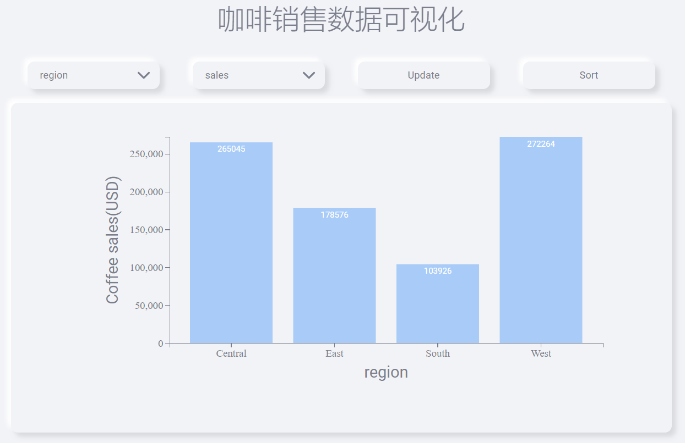
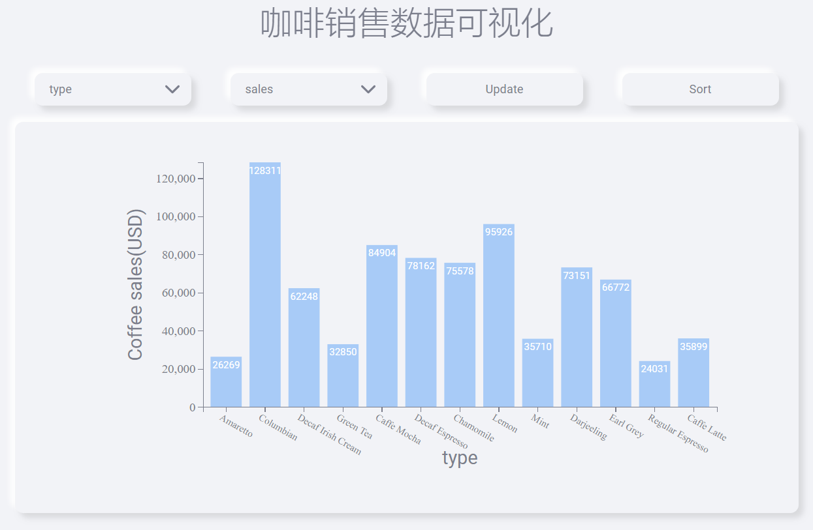
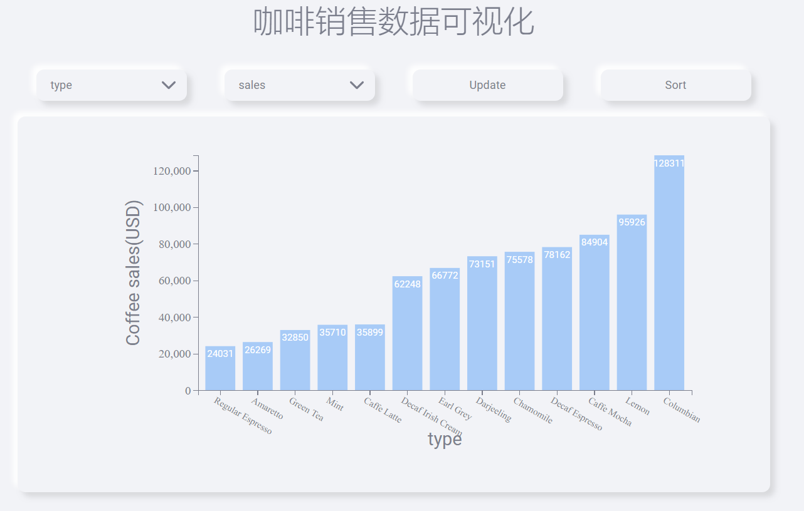

# d3-interactive-bar-chart

## 一、Quick Start

1. Start a python server in the root directory：python -m http.server
2. Visit: [localhost:8000]()
3. Then you can see the visualization.

## 二、Main Features

1. Interactive bar charts
   1. xDropdown：region、category、type、state、caffeination
   2. yDropdown：sales、profit
2. mouseover hightlight：Move the mouse over and out the bars, you can change their colors to orange.
3. Click-sorting：According to the value of the y-axis

## 三、Visualization

- Sales data by region

---

- Sales data by type

---

- Sorted Sales data by type

- etc.

## 四、Directory Structure

index.html：Page Entry

js/main.js：Main procedures for using d3.js to load, process data, and draw bar chart

css：

-- style.css

-- skeuos.css

data/coffee_data.csv

